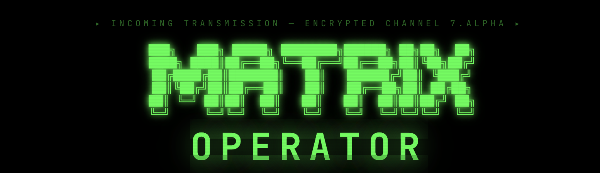

# Matrix Operator

> *"I need an Operator."*

[](https://nextjs.org)
[](https://react.dev)
[](https://typescriptlang.org)
[](https://tailwindcss.com)
[](https://anthropic.com)
[](LICENSE)



```
  ███╗   ███╗ █████╗ ████████╗██████╗ ██╗██╗  ██╗
  ████╗ ████║██╔══██╗╚══██╔══╝██╔══██╗██║╚██╗██╔╝
  ██╔████╔██║███████║   ██║   ██████╔╝██║ ╚███╔╝
  ██║╚██╔╝██║██╔══██║   ██║   ██╔══██╗██║ ██╔██╗
  ██║ ╚═╝ ██║██║  ██║   ██║   ██║  ██║██║██╔╝ ██╗
  ╚═╝     ╚═╝╚═╝  ╚═╝   ╚═╝   ╚═╝  ╚═╝╚═╝╚═╝  ╚═╝
         O P E R A T O R  //  NEBUCHADNEZZAR
```


You are the **Operator**. Not Neo. Not Trinity. Not Morpheus.

You're the one in the chair, watching green code cascade down a screen while your crew is plugged into a world that doesn't exist. You guide them through the streets of the simulation, hack cameras before Smith sees them, trigger lures to pull threats away, and keep the Nebuchadnezzar flying deep enough to avoid detection.

This is a **narrative terminal game** powered by Claude Sonnet (story orchestration) and Claude Haiku (agent AI). Every mission beat, every piece of agent dialogue, every tense moment as Smith closes in — driven by live AI.

You don't pull the trigger. You pull the strings.

---

## What Is This

Matrix Operator is a text-based terminal game set in the universe of *The Matrix*. You control the crew of the Nebuchadnezzar from the operator's console — two panels, split-screen:

- **Left panel** — your operator terminal. Commands, the live map, ship status.
- **Right panel** — agent comms. Chat with Neo, Trinity, Morpheus, Niobe, Ghost in real time.

Missions are AI-driven. The narrative progresses based on what you do and what you say. Agents respond in character. Agent Smith hunts.

```
┌──────────────────────────────┬──────────────────────────┐
│  OPERATOR CONSOLE  (left)    │  AGENT COMMS  (right)    │
│                              │                          │
│  ┌── LIVE MAP ─────────────┐ │  [Neo] [Trinity] [Ghost] │
│  │  ##C######d#############│ │──────────────────────────│
│  │  # N  .  .  S  .  . # │ │  TRINITY > I see agents. │
│  │  # .  .  .  .  . X . # │ │  OPR > Hack the camera.  │
│  └─────────────────────────┘ │  TRINITY > Done. Moving. │
│                              │                          │
│  operator@neb:~$ _           │  > type here...          │
└──────────────────────────────┴──────────────────────────┘
```

---

## Prerequisites

- **Node.js** 18+ and npm
- An **Anthropic API key** — the game uses Claude Sonnet to orchestrate story beats and Claude Haiku to power agent AI. Without it, the narrative won't run.

---

## Setup

**1. Clone and install**

```bash
git clone https://github.com/yourusername/matrix-operator.git
cd matrix-operator
npm install
```

**2. Add your Anthropic API key**

Create a `.env.local` file in the root of the project:

```bash
touch .env.local
```

Open it and add your key:

```env
ANTHROPIC_API_KEY=sk-ant-api03-your-key-here
```

Get your key at [console.anthropic.com](https://console.anthropic.com). The game uses:
- **Claude Sonnet** (`claude-sonnet-4-6`) — story orchestration, narrative beats
- **Claude Haiku** (`claude-haiku-4-5-20251001`) — agent responses and decisions

**3. Start the dev server**

```bash
npm run dev
```

Open [http://localhost:3000](http://localhost:3000). The terminal boots. The Nebuchadnezzar hums to life.

---

## Your First Session — The Tutorial

*Day 47 of the Resistance. Tunnel section 7-Alpha. 2.4km underwater.*

You've just booted into the operator console. The ship is running quiet. Before you accept any mission, you need to understand the fundamentals: **depth**, **EMPs**, and **sentinels**.

---

### Step 1 — Surface the Threat

The Nebuchadnezzar can operate at five depth levels. Deeper means safer but weaker broadcast signal. Shallower means more sentinels — but also a stronger connection to the Matrix.

Type this to rise toward the surface:

```
dive 5
```

At depth 5 you'll start seeing sentinel activity in the ship log. Those mechanical squids are scanning for you. This is normal. This is expected. This is where operators earn their keep.

---

### Step 2 — Charge the EMP

The ship's electromagnetic pulse is your panic button. It wipes out every machine in range. But it takes time to charge — and you can't fire it with agents jacked into the Matrix (it would kill them too).

Build up the charge:

```
charge
```

Watch the charge meter climb. Keep an eye on the ship log. The sentinels are getting closer.

---

### Step 3 — Fire the EMP

Once the charge hits 100%, discharge it. Every sentinel in range goes dark.

```
emp
```

The machines drop. The ship's systems flicker. You have breathing room.

Now dive back down to a safer operating depth before they regroup:

```
dive 1
```

The signal is stronger now. Good. You're ready to run a mission.

---

### Step 4 — Get Your First Mission

```
missions
```

The terminal pulls up the current mission briefing. Read it. This is the intel.

When you're ready:

```
accept
```

The mission is locked in. The construct is loaded. Time to jack someone in.

---

## Mission 01 — Trinity's Escape

*"We need to get Trinity out of Hart's apartment complex. Agents are in the building. There's a hardline on the third floor — she just needs to reach it."*

This is the first mission. It's **narrative-driven** — no tile map, pure story. Claude Sonnet orchestrates the scene. Trinity is inside. You are the voice in her ear.

---

### How It Works

Once you accept the mission, Trinity is jacked into the simulation. She's in the apartment. Agents are moving. You guide her out through the agent comms panel on the right.

Type naturally. Trinity (powered by Claude Haiku) responds in character and acts on your guidance:

```
Move toward the stairwell
Check the hallway — is anyone there?
Override the camera above the exit door
Stay low, head for the phone
```

The story progresses through beats:

```
awakening → guidance needed → en route → door blocked → path clear → phone approach → extraction → complete
```

Sonnet drives these beats forward every ~18 seconds based on what's happening. Trinity's biometrics, signal strength, Smith proximity — all tracked. You'll receive ambient narrative updates in the operator terminal.

---

### What You're Doing

You are talking Trinity through a hostile building. Agent Smith and his instances are sweeping the floors. Cameras cover the exits. The hardline phone — her extraction point — is three floors up.

Your job:

1. **Listen** — the narrative will tell you when there's a camera, a blocked door, a sound in the hallway
2. **Respond** — tell Trinity how to navigate. Hack remotely with `hack` commands. Download skills to help her
3. **Extract** — get her to the phone before Smith closes in

Useful commands during Mission 01:

```bash
hack CAM-1          # disable a camera you know about
hack DOOR-A         # breach a locked door
hack LURE-1         # trigger a lure system, pull Smith away
systems             # see what's hackable and what state it's in
status              # Trinity's health, Smith threat level, signal strength
```

Download skills to Trinity to improve her odds:

```bash
# type this in the AGENT COMMS panel (right side)
/download stealth   # makes Trinity invisible to cameras
/download hacking   # lets her override systems herself
/download lockpick  # open locked doors
/download kung-fu   # survive one Smith contact
```

---

### Tips for Mission 01

- **Talk to Trinity like she's real.** The AI responds to tone and context. Urgency works. Be specific.
- **Hack cameras before she walks past them.** Active cameras alert Smith. Disabled cameras don't.
- **A lure system (`LURE-1`) pulls Smith in the wrong direction.** Hack it early to buy time.
- **Check `systems` regularly.** It shows you what you can hack and whether it's been triggered.
- **If Smith closes in, don't panic.** Tell Trinity to evade. Stall. Buy time with a lure or a false alarm.

---

## Commands Reference

### Ship / Meta

| Command | Effect |
|---------|--------|
| `dive <1-5>` | Change depth. 1 = deep, quiet. 5 = shallow, exposed. |
| `charge` | Build up EMP charge (0–100%) |
| `emp` | Fire EMP — clears all machines nearby. Agents must be jacked out first. |
| `repair <system>` | Repair hull / power / broadcast array / life support |
| `status` | Full ship + mission status |
| `agents` | List all agents and their current state |
| `rank` | Your operator rank and progress |
| `score` | Score breakdown |
| `log` | Recent event log |
| `clear` | Clear the terminal |
| `help` | Full command list |

### Mission

| Command | Effect |
|---------|--------|
| `missions` | Show current mission briefing |
| `accept` | Lock in and start the mission |
| `decline` | Pass on the current mission |
| `jack <agent> in` | Jack an agent into the Matrix |
| `jack <agent> out` | Extract an agent via hardline |

### Tactical

| Command | Effect |
|---------|--------|
| `hack <label>` | Hack a hackable element by its label (e.g. `hack CAM-1`) |
| `systems` | List all hackable elements and their current state |
| `threat` | Show active threats — Smith instances, sentinels |
| `scan` | Scan for anomalies |
| `analyze <id>` | Deep-analyze a detected anomaly |
| `map` | Print the current mission map |
| `route <agent> <x> <y>` | Command agent to a position (map missions) |

---

## Agent Roster

The crew of the Nebuchadnezzar. Each responds differently. Each has a voice.

| Agent | Personality | Strength |
|-------|------------|---------|
| **Trinity** | Tactical. Composed. Direct. | Balanced — good for everything |
| **Neo** | Confident. Questioning. Growing. | Combat. Instinct. |
| **Morpheus** | Philosophical. Commanding. Believes. | Leadership. Endurance. |
| **Niobe** | Pragmatic. Brave. No-nonsense. | Speed. Navigation. |
| **Ghost** | Patient. Precise. Sharp. | Stealth. Marksmanship. |

---

## Skills

Download to any agent via the comms panel:

```bash
/download stealth     # invisible to cameras — walk past C tiles safely
/download hacking     # override systems without operator assistance
/download kung-fu     # survive one Smith contact
/download lockpick    # breach locked doors (d tiles)
/download combat      # firearms proficiency
/download pilot       # hovercraft + APU operations
```

Downloads take ~2.5 seconds. A progress bar runs. Stay cool.

---

## Map Symbols (Map-Based Missions)

| Symbol | Meaning |
|--------|---------|
| `N` `T` `M` `B` `G` | Neo, Trinity, Morpheus, Niobe, Ghost |
| `S` (red) | Agent Smith — **frozen until alerted** |
| `!` | Other threat |
| `X` | Exit hardline |
| `P` | Phone hardline |
| `A` (cyan) | Data terminal — hackable objective |
| `C` (yellow) | Active camera — **2-tile detection range** |
| `c` (dim) | Disabled camera — safe to pass |
| `d` (red) | Locked door |
| `D` | Open door |
| `#` / `.` | Wall / Floor |

---

## Smith Behavior

Agent Smith does not move until he has a reason to.

He activates when:
- An **active camera** spots an agent within 2 tiles
- A **hack attempt fails** and the element goes alarmed

Once active, Smith moves toward the camera that triggered, then hunts the nearest agent. He escalates: `lone → pursuit → replicating → swarm`. The longer he's active, the worse it gets.

**How to counter:**
- Disable cameras before agents walk past them
- Use lure systems to pull Smith in the wrong direction
- Download stealth to make agents camera-invisible
- EMP — but agents must be out first

---

## Ranking Up

Score accumulates across missions. Your rank determines how the resistance sees you.

| Rank | Points Required |
|------|----------------|
| Coppertop | 0 |
| Red Pill | 500 |
| Recruit | 1,500 |
| Operator | 3,000 |
| Hardliner | 6,000 |
| Ghost Protocol | 10,000 |
| Sentinel Bane | 15,000 |
| Zion's Last | 22,000 |
| Oracle's Chosen | 30,000 |
| **The One** | 35,000 |

Score bonuses: anomalies (+150 detected, +300 analyzed), agents extracted (+250 each), under par time (+500), EMP fired (+100), full extraction (+400).

Score penalties: agent injured (−200), agent killed (−500), mission failed (−300).

---

## Tech Stack

| Layer | Technology |
|-------|-----------|
| Framework | Next.js 15.1 (App Router) |
| UI | React 19, Tailwind CSS 4 |
| State | Zustand 5 |
| AI Narrative | Claude Sonnet (`claude-sonnet-4-6`) |
| Agent AI | Claude Haiku (`claude-haiku-4-5-20251001`) |
| Language | TypeScript 5.7 |
| Testing | Vitest 2.1 |

```bash
npm run dev          # development server
npm run build        # production build
npm run test         # run tests
npm run test:ui      # visual test runner
```

---

## Mission List

| # | Name | Type | Difficulty |
|---|------|------|-----------|
| 01 | Trinity's Escape | Narrative | ★☆☆☆☆ |
| 02 | Government Server Breach | Infiltration | ★★☆☆☆ |
| 03 | Trapped Operative | Rescue | ★★☆☆☆ |
| 04 | Merovingian's Archive | Data Heist | ★★★☆☆ |
| 05 | Smith Replication Crisis | Containment | ★★★★☆ |
| 06 | Sentinel Swarm | Ship Defense | ★★★★★ |

Mission 01 is live. Missions 02–06 are on the way.

---

## The Philosophy

> *"What you know you can't explain, but you feel it. You've felt it your entire life, that there's something wrong with the world."*

The interesting thing about being the Operator is that you never enter the Matrix. You sit in the real world — if you can call it that — and watch the code. You see what the agents can't. You know where the threats are before they do.

The game is built on that tension. You have the information. You have the tools. The question is whether you can communicate it fast enough, hack it quietly enough, and get everyone out alive.

Good luck, Operator.

---

*Built with Next.js, React, Zustand, and the Anthropic API.*

## Disclaimer

This project is a fan-made work inspired by The Matrix.
The Matrix and all related properties are owned by Warner Bros. Entertainment Inc.
This project is not affiliated with or endorsed by Warner Bros.

## Attribution

If you use or modify this project, please give proper credit.